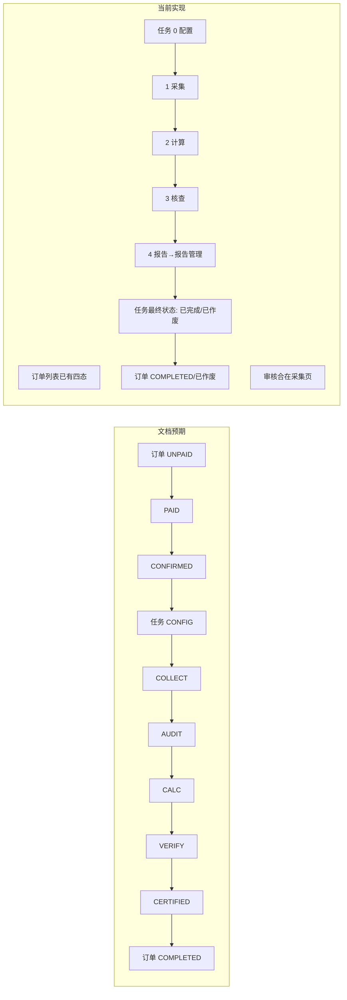
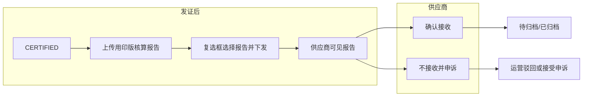

# PR：整体业务与产品设计审查

## PR 概述

- **类型**：文档 / 产品设计审查  
- **范围**：钢铁行业产业链碳足迹数据服务系统 — 整体业务流程与原型实现一致性；**任务管理仅定义为核查任务，报告相关统一在报告管理处理；任务 5 段 + 最终状态控订单**（已合并原 08 任务与报告边界方案）。  
- **结论**：完成基于 docs 的流程梳理与实现对照；明确任务 5 段（配置/采集/计算/核查/**报告**）、任务最终状态（进行中/已完成/已作废）与订单（已完成/已作废）的对应；报告下发、确认接收、申诉与归档的完整规则见 1.7 与 1.8。**第八节**对整体设计进行再次审计，核验与 02/03/04、05 标准合规及澄清消息文档的一致性。

---

## 一、整体业务总览

### 1.0 可信数据空间架构定位（摘要）

本系统为钢铁行业产业链可信数据空间上的业务应用；服务平台能力由行业功能节点（可信基座）提供，L4 通过接入连接器与平台对接。详细架构与合规设计见 **05 标准与合规 → [22 TDS 架构与合规设计说明](../05_标准与合规/22_TDS_架构与合规设计说明.md)**。

### 1.1 业务目标

系统支持**钢铁产业链碳足迹核算与认证**：从商城下单、运营配置任务与模板、供应商填报数据与凭证、LCA 计算、第三方核查到证书签发与归档，形成订单 → 任务 → 报告 的闭环。

### 1.2 角色与职责（文档定义）

| 角色 | 说明 | 关键动作 |
|------|------|----------|
| L1 商城用户 | 下单、支付、签署商务协议 | 订单创建与支付 |
| L2 供应商 | 数源方 | 填报数据、上传凭证 |
| L3 运营人员 | 中心运营 | 配置模板、审核数据、调度任务 |
| L4 核查机构 | 第三方（如 SGS/DNV） | 查看穿透数据、反馈核查意见 |

**当前原型范围说明**：本原型**不包含 L1 商城侧**页面或入口。订单→任务→报告的起点在原型中体现为：订单由运营端 Mock 数据或对接系统（如商城、ERP）生成，运营在「订单管理」中查看订单并对「已支付」订单执行「确认并分配任务（自营/委托）」后生成可执行子任务；正式环境由商城下单与支付回调产生订单。

**1.2.1 身份与接入（摘要）**：各角色在正式环境中均通过**统一身份登记**与空间/连接器鉴权后使用本应用；职责归属与规范对应见 **05 标准与合规 → [22 TDS 架构与合规设计说明](../05_标准与合规/22_TDS_架构与合规设计说明.md) 第 2 节**。现有 README、09 中「演示未强制登录」的说明保持不变，在此仅做集中引用与补充。

### 1.3 订单状态机（文档 02）

- **UNPAID** 待支付 → **PAID** 已支付 → **CONFIRMED** 已确认 → **COMPLETED** 已完成；若订单或任务被迫终止，可为 **已作废**（与任务最终状态对应，见 1.4）。  
- 触发：支付回调 → 运营/系统确认；**订单 COMPLETED** = 其下所有任务**最终状态**均为「已完成」；**订单已作废** = 存在任务最终状态「已作废」或按业务规则判定。

### 1.4 任务阶段与最终状态（文档 02 / 04，控全局）

- **任务阶段（5 段）**：**0 配置** → **1 采集** → **2 计算** → **3 核查** → **4 报告**。  
  - 阶段 0–3 在**任务管理**中完成（配置、采集与审核、LCA 计算、三方核查；核查机构上传核查报告与核查声明证书后，核查任务结束）。  
  - **阶段 4「报告」**：所有与报告/证书相关的后续动作（用印版上传、下发、供应商确认与申诉、待归档、归档上链）**仅在报告管理中处理**；任务列表仅展示「报告」并**统一跳转至报告管理**，不在此区分下发/待归档/已归档。
- **任务最终状态**（用于驱动订单）：  
  - **进行中**：阶段 0–3 或阶段 4 报告尚未终态。  
  - **已完成**：报告已**归档完成**（运营执行「确认归档 & 上链」后）→ 对应订单可汇总为 **COMPLETED**。  
  - **已作废**：任务或报告**被迫终止**（如报告/档案作废、异常关闭）→ 对应订单可判定 **已作废**。  
- **与订单的对应**：订单「已完成」= 其下全部任务最终状态为「已完成」；订单「已作废」= 存在任务「已作废」或业务规则判定作废。  

### 1.5 任务工作台与协作（文档 04）

- 任务执行工作台：配置(Stage 1)、采集与审核(Stage 2)、三方核查(Stage 3)。  
- Stage 2：驳回 → 回退 COLLECT；通过 → 进入 CALC。  
- Stage 3：异步等待三方；协作日志需时间/操作人/动作，澄清请求需高亮与提醒；**核查机构上传核查报告与核查声明证书后，任务管理侧该任务截止，后续进报告管理**。  

### 1.6 模板与凭证（文档 05）

- Excel 解析：Sheet → 工序，表头 → 字段名。  
- 凭证与工作簿绑定，不做行级关联；凭证清单由 Snapshot 的 `evidenceRequirements` 维护，通过 taskId 与任务关联。
- 数据资源与任务/报告的**目录登记与统一标识**按 TDS 规范设计，详见 **05 标准与合规 → [22 TDS 架构与合规设计说明](../05_标准与合规/22_TDS_架构与合规设计说明.md)**。

### 1.7 报告下发、归档与申诉（文档 04 / 02，均在报告管理完成）

本节为**报告阶段**的完整流程与商业规则，**全部在报告管理中完成**，任务管理不提供报告下发/用印版/归档入口。

**（1）下发前：用印版核算报告**

- 运营在**下发之前**需**上传一份线下用印完成的核算报告**（在**报告管理 → 档案详情**内完成，且须先收到核查报告与核查声明证书），系统以**版本记录**（草稿 → 用印版 V1）作为下发前置条件。

**（2）运营下发**

- 任务进入**报告阶段**且三件套齐备后，运营在**报告管理**页通过**复选框**勾选要下发的报告/证书，确认后执行「下发」至供应商；供应商端仅能看到被勾选下发的报告/证书。

**（3）供应商确认接收 vs 申诉**

- 下发后，供应商在「我的报告」中可见该报告，可**预览**后二选一：**确认接收**（此后不可再申诉）或**不接收并提起申诉**（点「我有异议」）。  
- **只有供应商确认接收后**，运营方才能在报告管理中执行「确认归档 & 上链」，报告才进入已归档；未确认接收前不会出现待归档、已归档。

**（4）待归档、已归档与申诉**

- 待归档、已归档仅在供应商确认接收后出现，该两态下**不会存在待处理申诉**，运营端**不展示申诉处理按钮**。
- **申诉中不可归档**：存在待处理申诉（申诉中）时，运营端**不可执行「确认归档 & 上链」**；须先处理申诉（驳回或接受）或等待供应商确认接收后，方可归档。原型与实现中归档按钮在申诉中时应置灰并提示「需先处理申诉或等待供应商确认接收后再归档」。

**（5）申诉通过后的流程（04 中明确）**

- 运营驳回或接受申诉；接受后建议「原任务回退至 VERIFY（重新核查）」等，见 04 文档。

### 1.8 任务管理与报告管理的边界（原 08 方案已并入）

- **任务管理**：仅负责**核查任务**，即 0 配置 → 1 采集 → 2 计算 → 3 核查；核查机构上传完毕核查报告与核查声明证书后，任务管理侧结束。任务列表**阶段 4 统一为「报告」**，点击后**仅跳转报告管理**，不在任务详情中做报告下发、用印版上传或归档。
- **报告管理**：自「三件套齐备」起负责：上传用印版 → 勾选报告/证书下发 → 供应商确认接收或申诉 → 申诉处理（若有）→ 确认归档并上链。**上链仅在「确认归档 & 上链」时触发**；报告版本与流转记录规则见 04 文档 2.8、2.9。
- **任务最终状态控订单**：归档完成 → 任务最终状态「已完成」→ 订单可 COMPLETED；任务/报告作废或终止 → 任务最终状态「已作废」→ 订单已作废。

**关键流程与数字合约的对应关系**见 **04 任务调度与状态机 2.10 节**；实现时需保证流程节点与合约签署/执行/存证可追溯。

---

## 二、文档与实现对照摘要

| 维度 | 文档定义 | 当前实现 | 结论 |
|------|-----------|-----------|------|
| 订单状态 | UNPAID→PAID→CONFIRMED→COMPLETED | 订单列表/详情已有「订单状态」四态及筛选，与 02 一致 | 已对齐 |
| 任务状态 | 5 段：配置/采集/计算/核查/**报告**；任务最终状态（进行中/已完成/已作废）控订单 | task_list 0–4：配置/采集/计算/核查/**报告**（点击跳报告管理）；CALC 即 LCA；AUDIT 为采集子状态；任务最终状态对应订单已完成/已作废 | 已对齐 |
| 任务工作台 | 多页详情 + 可选 SPA | task_workspace(SPA) + task_detail_*（多页），04 已明确二者并存及各自用途 | 已对齐 |
| 角色入口 | L1–L4 四类 | 门户已开放运营端、供应商工作台、认证机构工作台入口（supplier/dashboard、certifier/task_list） | 已对齐 |
| 供应商端 | L2 填报数据、上传凭证 | 供应商端已有「我的报告」确认接收与申诉；待办任务列表与填报闭环属**第一阶段 MVP 范围**（见 00_迭代计划），与 06 P0 一致，原型需可演示闭环 | 已对齐 |
| 认证端 | L4 穿透查看、反馈意见 | certifier/ 为演示占位；第一阶段要求核查仪表盘、核查任务管理、报告颁发管理（09 已覆盖），穿透查看可为简化版或后续迭代 | 部分对齐 |
| 采集与审核 | Stage 2 驳回/通过；AUDIT 为采集子状态 | task_detail_collect 有审核通过/驳回；列表将 COLLECT 与 AUDIT 合并为「采集」阶段展示（02/04 已约定） | 已对齐 |
| 协作日志 | 时间/操作人/动作；轮询或 WebSocket、澄清高亮 | 各 task_detail 有事件/日志区；04 已注明原型为静态/模拟，正式需轮询或 WebSocket，澄清高亮为交互规范 | 已对齐 |
| 模板与凭证 | Sheet→工序、凭证配置 | template_detail*、task_detail_config 有 Sheet/凭证/工序 | 基本对齐 |
| 报告下发与申诉 | 报告阶段全在报告管理：用印版、复选框下发、确认接收/申诉、归档；任务列表仅「报告」跳报告管理 | 任务列表阶段 4 为「报告」并跳报告管理；报告管理已支持用印版、下发、申诉处理、归档；供应商端确认接收与「我有异议」 | 已对齐 |

---

## 三、具体问题与建议

### 1. 订单状态机未在订单页体现

- **问题**：02 定义订单四态，当前订单列表/详情无“订单状态”字段与筛选，03 文档未展开流转说明。  
- **建议**：订单列表/详情增加“订单状态”（与四态一致）及筛选；03 中补 2–3 句订单状态流转说明。
- **状态**：已闭环（见第五节）。订单列表/详情已有四态及筛选；03 已含流转说明。

### 2. 任务状态缺少“待审核 (AUDIT)”独立阶段

- **问题**：文档含 AUDIT（待审核），实现为 5 段（配置/采集/计算/核查/报告），审核合在采集页内，列表无“待审核”。  
- **建议**：方案 A — 列表与进度条增加“待审核”阶段与文档一致；或方案 B — 文档明确“待审核”为采集阶段子状态，统一 00/02 表述。
- **状态**：已闭环（见第五节）。采用方案 B，02/04 已统一表述。

### 3. 任务工作台：SPA 与多页两套形态

- **问题**：02 描述为“单页 SPA”，实际存在 task_workspace(SPA) 与 task_detail_*（多页），列表主跳多页。  
- **建议**：04 明确“多页任务详情 + 可选 SPA 工作台”及各自使用场景，避免理解歧义。
- **状态**：已闭环（见第五节）。04 已明确二者并存及各自用途。

### 4. 门户仅开放运营端

- **问题**：供应商、认证机构点击提示“暂未接入”，无法从门户走通多角色。  
- **建议**：开放供应商 → supplier/dashboard、认证机构 → certifier/task_list；占位页可标注“演示占位”仍可跳转。
- **状态**：已闭环（见第五节）。门户已开放三端入口。

### 5. 供应商端无可用业务流程

- **问题**：supplier 仅占位，无待办任务列表与填报/凭证上传，无法形成“下发→填报→提交”闭环。
- **建议**：设计上明确至少“待办任务列表 + 单任务填报页（Excel 结构 + 凭证）”，与 task_detail_collect 运营审核联动；实现可先 Mock。
- **状态**：属**第一阶段 MVP 范围**（见 00_迭代计划）；设计见 02 功能与对接 → 06_供应商工作台功能清单与信息结构，原型需可演示闭环。

### 6. 认证机构端无可用业务流程

- **问题**：certifier 仅占位，无待核查列表、穿透查看、通过/驳回/澄清界面。  
- **建议**：设计上明确至少“待核查列表 + 任务详情（报告/凭证穿透）+ 操作区”，与 task_detail_verify 协作日志一致；实现可先 Mock。
- **状态**：后续迭代。设计见 02 功能与对接 → 09_核查机构端功能清单与入口说明。

### 7. 订单→任务→报告 串联与状态一致性

- **问题**：订单详情可跳任务、任务 4/5 阶段跳 report_mgt 的链路存在，但订单状态未体现，报告/归档触发条件未在文档写明。  
- **建议**：03/04 中增加 1–2 句：订单与子任务状态映射、报告管理/归档触发条件（如 CERTIFIED→待归档→已归档），与 task_list 跳转一致。
- **状态**：已闭环（见第五节）。03/04 已写明映射与归档触发条件。

### 8. 协作日志与 Stage 3 文档细化

- **问题**：02 要求轮询/WebSocket 与澄清高亮，原型是否实现未说明。  
- **建议**：04 中注明“原型阶段协作日志为静态/模拟，正式需轮询或 WebSocket”，并明确“澄清高亮与弹窗”为交互规范。
- **状态**：已闭环（见第五节）。04 已注明原型静态/模拟及澄清高亮为交互规范。

### 9. 报告下发、供应商确认接收与申诉窗口

- **问题**：当前文档与原型未区分「下发前上传用印版核算报告」「复选框选择报告/证书下发」；未体现「确认接收后不可申诉」及「待归档/已归档下无申诉（不展示驳回/接受按钮）」；供应商端无「确认接收」与「仅未确认接收时可申诉」的完整交互。
- **建议**：文档 04/02/06 按 1.7、1.8 修订；任务列表为 5 段（阶段 4 = 报告，跳报告管理）；报告管理负责用印版、下发、申诉、归档；任务最终状态（已完成/已作废）控订单。
- **状态**：已闭环（见第五节）。文档与原型已对齐；报告管理页支持用印版、复选框下发、申诉处理、归档；供应商端确认接收与申诉窗口已实现。

---

## 四、流程图（文档预期 vs 当前实现）

**发证后报告与申诉流程（详见 1.7）**

---

## 五、建议修正优先级

| 优先级 | 项 | 状态 | 说明 |
|--------|----|------|------|
| 高 | 任务状态与“待审核” | **已闭环** | 采用方案 B：待审核 (AUDIT) 为采集阶段子状态，列表仅展示「采集」不单独列出待审核；02/04 已统一表述。 |
| 高 | 角色入口 | **已闭环** | 门户已开放运营端、供应商、认证机构入口。 |
| 高 | 报告下发、确认接收与申诉 | **已闭环** | 文档 04/02/06 已更新；运营端待归档/已归档不展示申诉按钮；供应商端确认接收与申诉窗口；报告管理页已支持用印版上传与版本展示、复选框勾选报告/证书下发。 |
| 中 | 订单状态 | **已闭环** | 订单列表/详情已有四态及筛选；01 可再补 2–3 句流转说明（可选）。 |
| 中 | 任务工作台形态 | **已闭环** | 04 已明确多页任务详情 + 可选 SPA 工作台及各自用途。 |
| 低 | 供应商/认证端原型 | 供应商端属第一阶段 | 供应商端待办任务列表与填报闭环属第一阶段 MVP（见 00_迭代计划）；认证端待核查列表与穿透操作可后续补全；04 已补充协作日志/澄清的 prototype 说明。 |
| 低 | 报告管理下发与版本 | **已闭环** | 报告管理页已支持下发前上传用印版（版本记录）、复选框勾选报告/证书下发。 |

---

## 六、后续迭代与已移除页面

当前版本（MVP）已移除以下占位/后续迭代页面，以与有入口且实际使用的功能保持一致：**治理与合规**（原 `operator/governance.html`）、**模板高级配置**（原 `template_detail_advanced.html`）、**模板表单模式**（原 `template_detail_form_mode.html`）。上述能力规划为后续迭代，若需参考可从版本历史恢复。

---

## 七、涉及文件与可执行后续

- **文档**：`01_业务与流程/01_整体业务与产品设计审查.md`、`02_全局数据字典与枚举.md`、`03_订单管理逻辑.md`、`04_任务调度与状态机.md`；`02_功能与对接/05_模板引擎解析逻辑.md`、`06_供应商工作台功能清单与信息结构.md`、`07_Mock数据说明.md`  
- **原型**：`index.html`、`operator/order.html`、`operator/self_operated_task_list.html`、`operator/task_detail_*.html`、`operator/task_workspace.html`、`operator/report_mgt.html`、`operator/report_detail.html`、`supplier/*`、`certifier/*`  

本 PR 为**产品设计层面审查结论**，不包含代码改动；可按优先级拆分为具体需求或开发任务（如：更新 02/04 文案、门户开放入口、订单页加状态字段、报告下发与申诉规则在 04/02/06 文档中落地、运营端待归档/已归档不展示申诉按钮、供应商端确认接收与申诉窗口等）单独落地。

---

## 八、全局设计再次审计

本节对整体业务与产品设计进行**再次审计**，以 01 为锚点，对照 02/03/04、05 标准与合规及 04 澄清与消息，核验链路一致性、边界清晰度及与可信数据空间理念的呼应。

### 8.1 审计范围与依据

| 维度 | 依据文档 | 审计要点 |
|------|----------|----------|
| 订单—任务—报告链路 | 02、03、04 | 状态定义一致、触发条件与驱动关系明确 |
| 任务 5 段与报告边界 | 01 第 1.4/1.7/1.8 节，04 第 2.4/2.7 节 | 任务管理=核查任务、报告管理=报告全流程，阶段 4 仅跳转 |
| 报告下发/确认/申诉/归档 | 01 第 1.7 节，04 第 2.5/2.6 节，02 报告主状态 | 用印版→下发→确认接收/申诉→归档；申诉中不可归档；待归档/已归档无申诉按钮 |
| 身份、目录、数字合约 | 05 → 20/21/22，01 第 1.0/1.2.1/1.6 | 架构定位、身份登记、目录与标识、数字合约与流程节点对应 |
| 驳回、澄清、异议 | 04 澄清与消息 18/19 | 阶段、责任方、消息可见性、与任务/报告状态衔接 |

### 8.2 一致性检查结果

- **订单状态与任务最终状态**：02 定义订单 UNPAID→PAID→CONFIRMED→COMPLETED/REVOKED；任务最终状态（进行中/已完成/已作废）驱动订单 COMPLETED/已作废。01 第 1.3、1.4 与 04 第 2.7、03 订单管理逻辑**表述一致**，无冲突。
- **任务 5 段与报告边界**：任务管理仅负责 0 配置→1 采集→2 计算→3 核查；阶段 4「报告」仅作展示并跳转报告管理；报告管理负责用印版、下发、确认/申诉、归档。01 第 1.8 与 04 第 2.4、02 第 1.2 **一致**。
- **报告主状态与申诉规则**：02 采用 process/archived/revoked 三态 + 申诉叠加；申诉中不可归档；待归档/已归档不展示申诉处理。与 01 第 1.7、04 第 2.5/2.6 **一致**。
- **驳回/澄清/异议**：18 定义阶段、责任方与消息可见性，19 为实施方案；01 第 1.5 仅摘要提及澄清高亮与协作日志，未重复定义，**无冲突**；需落地时以 18/19 为准。

### 8.3 与标准合规的呼应

- **01 已引用**：第 1.0 节引用 22（TDS 架构与合规）、第 1.2.1 节引用 22（身份与接入）、第 1.6 节引用 22（目录与统一标识）、第 1.8 末引用 04 第 2.10（数字合约与业务流程对应）。
- **21 不一致项**：6 条均已「已采纳（待实施）」；01 通过引用 22、11 及 04 第 2.10 在**设计层**完成呼应，具体实施在正式环境与接口/合规落地时执行，**无需在 01 内重复登记**。
- **建议**：若后续 21 新增不一致项或 22/20 有重大修订，应在 01 第 1.0/1.2.1/1.6/1.8 中酌情补充一句引用或修订说明，保持「业务总览—标准合规」可追溯。

### 8.4 残留差距与建议

| 项 | 说明 | 建议 |
|----|------|------|
| 订单状态在订单页的展示 | 02/03 已定义四态及与任务的对应，实现上订单列表/详情已有状态与筛选；01 第三、五节中「订单状态未在订单页体现」已按优先级闭环，**无新增差距**。 | 保持现状；若 03 需更细流转说明可单独在 03 中补 2～3 句。 |
| 供应商/认证端闭环 | 供应商端待办列表与填报闭环属第一阶段 MVP（01 第二节已标「已对齐」）；认证端穿透可为简化版或后续迭代。 | 供应商端闭环与 00_迭代计划一致；新需求可继续在 06/09 中扩展。 |
| 数字合约与流程节点 | 04 第 2.10 已给出业务节点与数字合约的对应表；01 第 1.8 末已引用。**设计层完整**，实施期需与合约创建/签署/存证系统对接。 | 实施时以 04 第 2.10 与 11 接口设计为准。 |
| 目录与标识 | 22 已说明数据资源与任务/报告的目录登记与统一标识；01 第 1.6 已引用。**无新增差距**。 | 实施时在数据模型与接口中落实 22 约定。 |

### 8.5 审计结论

- **全局设计**：订单—任务—报告链路、任务 5 段与报告管理边界、报告下发/确认接收/申诉/归档规则在 01/02/03/04 中**一致且闭环**，无需在 01 内做结构性修改。
- **与标准合规**：01 通过引用 20/21/22 及 04 第 2.10 与「可信数据空间」架构、身份、目录、数字合约对齐；21 中 6 条不一致项已采纳待实施，由 22、11 及实施期文档承接。
- **后续**：定期（如版本发布前）可再执行一次「01 与 02/04/05、实现页面对照」的快速审计，若有 02/04/22 的实质性修订，同步更新 01 第 1.3～1.8 的表述与引用即可。
