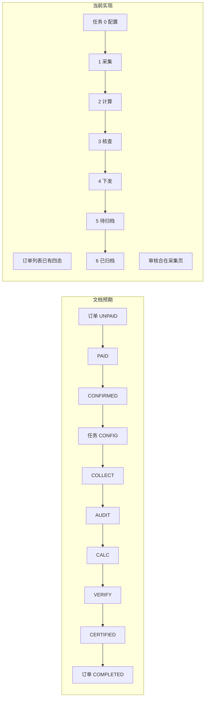
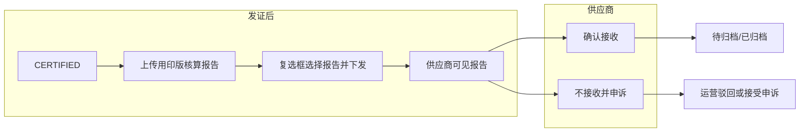

# PR：整体业务与产品设计审查

## PR 概述

- **类型**：文档 / 产品设计审查  
- **范围**：钢铁行业产业链碳足迹数据服务系统 — 整体业务流程与原型实现一致性  
- **结论**：完成基于 docs 的流程梳理与实现对照，列出 9 类问题及优先级建议，供产品与开发对齐；并明确报告下发、供应商确认接收、申诉与归档的完整业务规则（见 1.7）。

---

## 一、整体业务总览

### 1.1 业务目标

系统支持**钢铁产业链碳足迹核算与认证**：从商城下单、运营配置任务与模板、供应商填报数据与凭证、LCA 计算、第三方核查到证书签发与归档，形成订单 → 任务 → 报告 的闭环。

### 1.2 角色与职责（文档定义）

| 角色 | 说明 | 关键动作 |
|------|------|----------|
| L1 商城用户 | 下单、支付、签署商务协议 | 订单创建与支付 |
| L2 供应商 | 数源方 | 填报数据、上传凭证 |
| L3 运营人员 | 中心运营 | 配置模板、审核数据、调度任务 |
| L4 核查机构 | 第三方（如 SGS/DNV） | 查看穿透数据、反馈核查意见 |

### 1.3 订单状态机（文档 02）

- **UNPAID** 待支付 → **PAID** 已支付 → **CONFIRMED** 已确认 → **COMPLETED** 已完成  
- 触发：支付回调 → 运营/系统确认 → 全部关联子任务结束后订单完成。

### 1.4 任务状态机（文档 02）

- **CONFIG** 待配置 → **COLLECT** 待填报 → **AUDIT** 待审核 → **CALC** LCA 计算 → **VERIFY** 核查中 → **CERTIFIED** 已发证；发证后任务阶段为**下发** → 待归档 → 已归档（任务列表 7 段：配置/采集/计算/核查/下发/待归档/已归档）。  
- 关键节点：运营配置模板(CONFIG)、供应商填报(COLLECT)、运营审核(AUDIT)、**LCA 计算(CALC)**、第三方核查(VERIFY)、发证上链(CERTIFIED)。**CALC 即 LCA 计算**，LCA 为独立系统（当前南钢部署），当前手工摆渡，后续迭代预留接口对接。

### 1.5 任务工作台与协作（文档 04）

- 任务执行工作台：配置(Stage 1)、采集与审核(Stage 2)、三方核查(Stage 3)。  
- Stage 2：驳回 → 回退 COLLECT；通过 → 进入 CALC。  
- Stage 3：异步等待三方；协作日志需时间/操作人/动作，澄清请求需高亮与提醒。  

### 1.6 模板与凭证（文档 05）

- Excel 解析：Sheet → 工序，表头 → 字段名。  
- 凭证配置：requirementId、name、relatedFields、description、exampleFileUrl 等，与工序/字段关联。

### 1.7 报告下发、归档与申诉（文档 04 / 02 补充约定）

本节为发证后至归档的完整流程与商业规则，与 04 任务调度与状态机、02 全局数据字典一致。

**（1）下发前：用印版核算报告**

- 运营在**下发之前**需**上传一份线下用印完成的核算报告**，用于**替换**此前流转给核查机构的草稿；系统以**版本记录**该替换（如 草稿 → 用印版 V1），作为下发的前置条件。

**（2）运营下发**

- 任务 **CERTIFIED（已发证）** 后，运营在报告管理页通过**复选框**勾选要下发的报告/证书（核算报告、核查报告、声明证书），确认后执行「下发」至供应商；供应商端仅能看到被勾选下发的报告/证书。
- **任务列表增加「下发」阶段**：任务列表显式增加阶段**「已下发」**（发证后、供应商确认接收前），用于区分「已发证未下发」与「已下发待供应商确认」；与「待归档」「已归档」并列（阶段 0–6：配置/采集/计算/核查/**下发**/待归档/已归档）。

**（3）供应商确认接收 vs 申诉**

- 下发后，供应商在「我的报告」中可见该报告，可**预览**后二选一：**确认接收**（此后不可再申诉，流程终止）或**不接收并提起申诉**（原因+附件）。申诉窗口严格限定在「运营下发后、供应商确认接收前」。
- **只有供应商确认接收后**，运营方才可执行「待归档」/「确认归档并上链」，报告才进入待归档（process）、已归档（archived）；未确认接收前不会出现待归档、已归档。

**（4）待归档、已归档与申诉**

- 待归档、已归档仅在供应商确认接收后出现，该两态下**不会存在待处理申诉**，运营端**不展示任何申诉处理按钮**（既不接受也不驳回）。

**（5）申诉通过后的流程（04 中明确）**

- 建议采用「原任务回退至 VERIFY（重新核查）」：同一 taskId 增加申诉轮次标识，重新走核查→发证→待归档；可选「新建申诉任务」作为扩展。

---

## 二、文档与实现对照摘要

| 维度 | 文档定义 | 当前实现 | 结论 |
|------|-----------|-----------|------|
| 订单状态 | UNPAID→PAID→CONFIRMED→COMPLETED | 订单列表/详情已有「订单状态」四态及筛选，与 02 一致 | 已对齐 |
| 任务状态 | CONFIG→COLLECT→AUDIT→CALC(LCA)→VERIFY→CERTIFIED；发证后 下发→待归档→已归档 | task_list 0–6：配置/采集/计算/核查/**下发**/待归档/已归档；CALC 即 LCA（独立系统、手工摆渡、预留接口）；AUDIT 为采集阶段子状态，列表不单独展示 | 已对齐 |
| 任务工作台 | 多页详情 + 可选 SPA | task_workspace(SPA) + task_detail_*（多页），04 已明确二者并存及各自用途 | 已对齐 |
| 角色入口 | L1–L4 四类 | 门户已开放运营端、供应商工作台、认证机构工作台入口（supplier/dashboard、certifier/task_list） | 已对齐 |
| 供应商端 | L2 填报数据、上传凭证 | 供应商端已有「我的报告」确认接收与申诉；待办任务列表与填报闭环为后续迭代 | 部分对齐 |
| 认证端 | L4 穿透查看、反馈意见 | certifier/ 为演示占位，待核查列表与穿透操作为后续迭代 | 部分对齐 |
| 采集与审核 | Stage 2 驳回/通过；AUDIT 为采集子状态 | task_detail_collect 有审核通过/驳回；列表将 COLLECT 与 AUDIT 合并为「采集」阶段展示（02/04 已约定） | 已对齐 |
| 协作日志 | 时间/操作人/动作；轮询或 WebSocket、澄清高亮 | 各 task_detail 有事件/日志区；04 已注明原型为静态/模拟，正式需轮询或 WebSocket，澄清高亮为交互规范 | 已对齐 |
| 模板与凭证 | Sheet→工序、凭证配置 | template_detail*、task_detail_config 有 Sheet/凭证/工序 | 基本对齐 |
| 报告下发与申诉 | 下发前上传用印版（版本记录）；复选框勾选报告/证书下发；下发后、确认接收前可申诉；确认接收后待归档/归档，无申诉操作 | 任务列表 7 段含「下发」；报告管理页已支持「上传用印版」与版本展示、复选框勾选报告/证书后「下发」；待归档/已归档不展示申诉按钮；供应商端已有「确认接收」与申诉窗口 | 已对齐 |

---

## 三、具体问题与建议

### 1. 订单状态机未在订单页体现

- **问题**：02 定义订单四态，当前订单列表/详情无“订单状态”字段与筛选，03 文档未展开流转说明。  
- **建议**：订单列表/详情增加“订单状态”（与四态一致）及筛选；03 中补 2–3 句订单状态流转说明。

### 2. 任务状态缺少“待审核 (AUDIT)”独立阶段

- **问题**：文档 6 态含 AUDIT，实现为 5 个阶段标签（配置/采集/计算/核查/待归档/已归档），审核合在采集页内，列表无“待审核”。  
- **建议**：方案 A — 列表与进度条增加“待审核”阶段与文档一致；或方案 B — 文档明确“待审核”为采集阶段子状态，统一 00/02 表述。

### 3. 任务工作台：SPA 与多页两套形态

- **问题**：02 描述为“单页 SPA”，实际存在 task_workspace(SPA) 与 task_detail_*（多页），列表主跳多页。  
- **建议**：04 明确“多页任务详情 + 可选 SPA 工作台”及各自使用场景，避免理解歧义。

### 4. 门户仅开放运营端

- **问题**：供应商、认证机构点击提示“暂未接入”，无法从门户走通多角色。  
- **建议**：开放供应商 → supplier/dashboard、认证机构 → certifier/task_list；占位页可标注“演示占位”仍可跳转。

### 5. 供应商端无可用业务流程

- **问题**：supplier 仅占位，无待办任务列表与填报/凭证上传，无法形成“下发→填报→提交”闭环。  
- **建议**：设计上明确至少“待办任务列表 + 单任务填报页（Excel 结构 + 凭证）”，与 task_detail_collect 运营审核联动；实现可先 Mock。

### 6. 认证机构端无可用业务流程

- **问题**：certifier 仅占位，无待核查列表、穿透查看、通过/驳回/澄清界面。  
- **建议**：设计上明确至少“待核查列表 + 任务详情（报告/凭证穿透）+ 操作区”，与 task_detail_verify 协作日志一致；实现可先 Mock。

### 7. 订单→任务→报告 串联与状态一致性

- **问题**：订单详情可跳任务、任务 4/5 阶段跳 report_mgt 的链路存在，但订单状态未体现，报告/归档触发条件未在文档写明。  
- **建议**：03/04 中增加 1–2 句：订单与子任务状态映射、报告管理/归档触发条件（如 CERTIFIED→待归档→已归档），与 task_list 跳转一致。

### 8. 协作日志与 Stage 3 文档细化

- **问题**：02 要求轮询/WebSocket 与澄清高亮，原型是否实现未说明。  
- **建议**：04 中注明“原型阶段协作日志为静态/模拟，正式需轮询或 WebSocket”，并明确“澄清高亮与弹窗”为交互规范。

### 9. 报告下发、供应商确认接收与申诉窗口

- **问题**：当前文档与原型未区分「下发前上传用印版核算报告」「复选框选择报告/证书下发」；未体现「确认接收后不可申诉」及「待归档/已归档下无申诉（不展示驳回/接受按钮）」；供应商端无「确认接收」与「仅未确认接收时可申诉」的完整交互。
- **建议**：文档 04/02/06 按 1.7 与计划修订（2.5 下发前用印版与版本、2.6 申诉与确认接收、任务阶段与下发对应）；任务列表已增加「下发」阶段（0–6：配置/采集/计算/核查/下发/待归档/已归档）；运营端 report_mgt/report_detail 对待归档与已归档不展示申诉处理按钮；供应商端 reports 已增加「确认接收」与「仅未确认接收时可申诉」；报告管理页已支持「下发前上传用印版」与「复选框下发」。

---

## 四、流程图（文档预期 vs 当前实现）

**发证后报告与申诉流程（详见 1.7）**

---

## 五、建议修正优先级

| 优先级 | 项 | 状态 | 说明 |
|--------|----|------|------|
| 高 | 任务状态与“待审核” | **已闭环** | 采用方案 B：待审核 (AUDIT) 为采集阶段子状态，列表仅展示「采集」不单独列出待审核；02/04 已统一表述。 |
| 高 | 角色入口 | **已闭环** | 门户已开放运营端、供应商、认证机构入口。 |
| 高 | 报告下发、确认接收与申诉 | **已闭环** | 文档 04/02/06 已更新；运营端待归档/已归档不展示申诉按钮；供应商端确认接收与申诉窗口；报告管理页已支持用印版上传与版本展示、复选框勾选报告/证书下发。 |
| 中 | 订单状态 | **已闭环** | 订单列表/详情已有四态及筛选；01 可再补 2–3 句流转说明（可选）。 |
| 中 | 任务工作台形态 | **已闭环** | 04 已明确多页任务详情 + 可选 SPA 工作台及各自用途。 |
| 低 | 供应商/认证端原型 | 后续迭代 | 供应商端待办任务列表与填报闭环、认证端待核查列表与穿透操作可后续补全；04 已补充协作日志/澄清的 prototype 说明。 |
| 低 | 报告管理下发与版本 | **已闭环** | 报告管理页已支持下发前上传用印版（版本记录）、复选框勾选报告/证书下发。 |

---

## 六、后续迭代与已移除页面

当前版本（MVP）已移除以下占位/后续迭代页面，以与有入口且实际使用的功能保持一致：**治理与合规**（原 `operator/governance.html`）、**模板高级配置**（原 `template_detail_advanced.html`）、**模板表单模式**（原 `template_detail_form_mode.html`）。上述能力规划为后续迭代，若需参考可从版本历史恢复。

---

## 七、涉及文件与可执行后续

- **文档**：`docs/01_整体业务与产品设计审查.md`、`docs/02_全局数据字典与枚举.md`、`docs/03_订单管理逻辑.md`、`docs/04_任务调度与状态机.md`、`docs/05_模板引擎解析逻辑.md`、`docs/06_供应商工作台功能清单与信息结构.md`、`docs/07_Mock数据说明.md`  
- **原型**：`index.html`、`operator/order.html`、`operator/self_operated_task_list.html`、`operator/task_detail_*.html`、`operator/task_workspace.html`、`operator/report_mgt.html`、`operator/report_detail.html`、`supplier/*`、`certifier/*`  

本 PR 为**产品设计层面审查结论**，不包含代码改动；可按优先级拆分为具体需求或开发任务（如：更新 02/04 文案、门户开放入口、订单页加状态字段、报告下发与申诉规则在 04/02/06 文档中落地、运营端待归档/已归档不展示申诉按钮、供应商端确认接收与申诉窗口等）单独落地。
