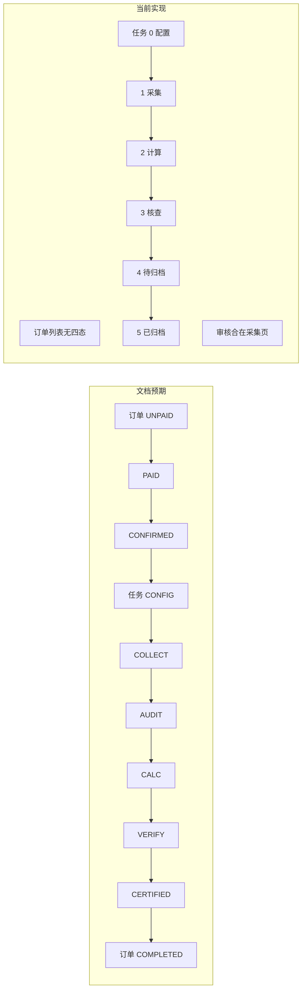

# PR：整体业务与产品设计审查

## PR 概述

- **类型**：文档 / 产品设计审查  
- **范围**：钢铁行业产业链碳足迹数据服务系统 — 整体业务流程与原型实现一致性  
- **结论**：完成基于 docs 的流程梳理与实现对照，列出 8 类问题及优先级建议，供产品与开发对齐。

---

## 一、整体业务总览

### 1.1 业务目标

系统支持**钢铁产业链碳足迹核算与认证**：从商城下单、运营配置任务与模板、供应商填报数据与凭证、LCA 计算、第三方核查到证书签发与归档，形成订单 → 任务 → 报告 的闭环。

### 1.2 角色与职责（文档定义）

| 角色 | 说明 | 关键动作 |
|------|------|----------|
| L1 商城用户 | 下单、支付、签署商务协议 | 订单创建与支付 |
| L2 供应商 | 数源方 | 填报数据、上传凭证 |
| L3 运营人员 | 中心运营 | 配置模板、审核数据、调度任务 |
| L4 核查机构 | 第三方（如 SGS/DNV） | 查看穿透数据、反馈核查意见 |

### 1.3 订单状态机（文档 00）

- **UNPAID** 待支付 → **PAID** 已支付 → **CONFIRMED** 已确认 → **COMPLETED** 已完成  
- 触发：支付回调 → 运营/系统确认 → 全部关联子任务结束后订单完成。

### 1.4 任务状态机（文档 00）

- **CONFIG** 待配置 → **COLLECT** 待填报 → **AUDIT** 待审核 → **CALC** 计算中 → **VERIFY** 核查中 → **CERTIFIED** 已发证  
- 关键节点：运营配置模板(CONFIG)、供应商填报(COLLECT)、运营审核(AUDIT)、LCA 计算(CALC)、第三方核查(VERIFY)、发证上链(CERTIFIED)。

### 1.5 任务工作台与协作（文档 02）

- 任务执行工作台：配置(Stage 1)、采集与审核(Stage 2)、三方核查(Stage 3)。  
- Stage 2：驳回 → 回退 COLLECT；通过 → 进入 CALC。  
- Stage 3：异步等待三方；协作日志需时间/操作人/动作，澄清请求需高亮与提醒。  

### 1.6 模板与凭证（文档 03）

- Excel 解析：Sheet → 工序，表头 → 字段名。  
- 凭证配置：requirementId、name、relatedFields、description、exampleFileUrl 等，与工序/字段关联。

---

## 二、文档与实现对照摘要

| 维度 | 文档定义 | 当前实现 | 结论 |
|------|-----------|-----------|------|
| 订单状态 | UNPAID→PAID→CONFIRMED→COMPLETED | 订单页仅“支付状态”、子任务进度，无订单级四态 | 不一致 |
| 任务状态 | CONFIG→COLLECT→**AUDIT**→CALC→VERIFY→CERTIFIED | task_list 0–5：配置/采集/计算/核查/待归档/已归档，无单独“待审核” | 不一致 |
| 任务工作台 | 单页 SPA、activeStep 控制 | task_workspace(SPA) + task_detail_*(多页) 两套，列表主入口为多页 | 形态不一致 |
| 角色入口 | L1–L4 四类 | 门户仅运营端可进，供应商/认证机构“暂未接入” | 角色链路断裂 |
| 供应商端 | L2 填报数据、上传凭证 | supplier/ 仅占位页，无任务列表与填报 | 无可用流程 |
| 认证端 | L4 穿透查看、反馈意见 | certifier/ 仅占位页 | 无可用流程 |
| 采集与审核 | Stage 2 驳回/通过 | task_detail_collect 有审核通过/驳回，列表无“待审核”阶段 | 逻辑有、列表未体现 AUDIT |
| 协作日志 | 时间/操作人/动作；轮询或 WebSocket、澄清高亮 | 各 task_detail 有事件/日志区；轮询与澄清高亮未在文档说明 | 部分对齐 |
| 模板与凭证 | Sheet→工序、凭证配置 | template_detail*、task_detail_config 有 Sheet/凭证/工序 | 基本对齐 |

---

## 三、具体问题与建议

### 1. 订单状态机未在订单页体现

- **问题**：00 定义订单四态，当前订单列表/详情无“订单状态”字段与筛选，01 文档未展开流转说明。  
- **建议**：订单列表/详情增加“订单状态”（与四态一致）及筛选；01 中补 2–3 句订单状态流转说明。

### 2. 任务状态缺少“待审核 (AUDIT)”独立阶段

- **问题**：文档 6 态含 AUDIT，实现为 5 个阶段标签（配置/采集/计算/核查/待归档/已归档），审核合在采集页内，列表无“待审核”。  
- **建议**：方案 A — 列表与进度条增加“待审核”阶段与文档一致；或方案 B — 文档明确“待审核”为采集阶段子状态，统一 00/02 表述。

### 3. 任务工作台：SPA 与多页两套形态

- **问题**：02 描述为“单页 SPA”，实际存在 task_workspace(SPA) 与 task_detail_*（多页），列表主跳多页。  
- **建议**：02 明确“多页任务详情 + 可选 SPA 工作台”及各自使用场景，避免理解歧义。

### 4. 门户仅开放运营端

- **问题**：供应商、认证机构点击提示“暂未接入”，无法从门户走通多角色。  
- **建议**：开放供应商 → supplier/dashboard、认证机构 → certifier/task_list；占位页可标注“演示占位”仍可跳转。

### 5. 供应商端无可用业务流程

- **问题**：supplier 仅占位，无待办任务列表与填报/凭证上传，无法形成“下发→填报→提交”闭环。  
- **建议**：设计上明确至少“待办任务列表 + 单任务填报页（Excel 结构 + 凭证）”，与 task_detail_collect 运营审核联动；实现可先 Mock。

### 6. 认证机构端无可用业务流程

- **问题**：certifier 仅占位，无待核查列表、穿透查看、通过/驳回/澄清界面。  
- **建议**：设计上明确至少“待核查列表 + 任务详情（报告/凭证穿透）+ 操作区”，与 task_detail_verify 协作日志一致；实现可先 Mock。

### 7. 订单→任务→报告 串联与状态一致性

- **问题**：订单详情可跳任务、任务 4/5 阶段跳 report_mgt 的链路存在，但订单状态未体现，报告/归档触发条件未在文档写明。  
- **建议**：01/02 中增加 1–2 句：订单与子任务状态映射、报告管理/归档触发条件（如 CERTIFIED→待归档→已归档），与 task_list 跳转一致。

### 8. 协作日志与 Stage 3 文档细化

- **问题**：02 要求轮询/WebSocket 与澄清高亮，原型是否实现未说明。  
- **建议**：02 中注明“原型阶段协作日志为静态/模拟，正式需轮询或 WebSocket”，并明确“澄清高亮与弹窗”为交互规范。

---

## 四、流程图（文档预期 vs 当前实现）

---

## 五、建议修正优先级

| 优先级 | 项 | 动作 |
|--------|----|------|
| 高 | 任务状态与“待审核” | 明确是否保留 AUDIT 独立阶段，统一 00/02 与 task_list、task_detail_collect 表述 |
| 高 | 角色入口 | 门户开放供应商、认证机构入口；文档说明当前原型角色范围 |
| 中 | 订单状态 | 订单列表/详情增加订单状态及筛选；01 补充订单状态流转 |
| 中 | 任务工作台形态 | 02 明确 SPA 与多页并存及各自用途 |
| 低 | 供应商/认证端原型 | 至少各有一个可用的列表/详情页与 L2/L4 对应；02 补充协作日志/澄清的 prototype 说明 |

---

## 六、后续迭代与已移除页面

当前版本（MVP）已移除以下占位/后续迭代页面，以与有入口且实际使用的功能保持一致：**治理与合规**（原 `operator/governance.html`）、**模板高级配置**（原 `template_detail_advanced.html`）、**模板表单模式**（原 `template_detail_form_mode.html`）。上述能力规划为后续迭代，若需参考可从版本历史恢复。

---

## 七、涉及文件与可执行后续

- **文档**：`docs/00_全局数据字典与枚举.md`、`docs/01_订单管理逻辑.md`、`docs/02_任务调度与状态机.md`、`docs/03_模板引擎解析逻辑.md`  
- **原型**：`index.html`、`operator/order.html`、`operator/self_operated_task_list.html`、`operator/task_detail_*.html`、`operator/task_workspace.html`、`supplier/*`、`certifier/*`  

本 PR 为**产品设计层面审查结论**，不包含代码改动；可按优先级拆分为具体需求或开发任务（如：更新 00/02 文案、门户开放入口、订单页加状态字段等）单独落地。
