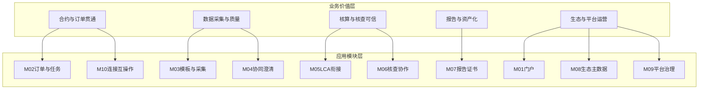

# 产品建设方案总册（目标态）

本文档描述**目标态**产品能力与模块划分，用于对外讲清「产品由哪些大块构成」、对内支撑 [模块化报价单](碳足迹系统_模块化报价单.xlsx) 与交付范围对齐。**不替代**业务流程与状态规则的权威表述：订单/任务/报告边界与申诉归档等仍以 [01_整体业务与产品设计审查](../docs/01_业务与流程/01_整体业务与产品设计审查.md)、[04_任务调度与状态机](../docs/01_业务与流程/04_任务调度与状态机.md)、[08_PR_任务与报告边界设计方案](../docs/02_功能与对接/08_PR_任务与报告边界设计方案.md) 为准。迭代节奏见 [迭代计划与排期说明](../docs/00_迭代计划/迭代计划与排期说明.md)。

---

## 一、产品定位与范围边界

### 1.1 价值主张

为钢铁产业链提供 **产品碳足迹核算与第三方核查认证** 的数字化闭环：从订单与任务编排、模板化数据采集与凭证、生命周期计算衔接、核查协作，到报告与证书的用印、下发、供应商确认或申诉、归档与可追溯，形成 **订单 → 任务 → 报告** 的可运营链路。架构定位摘要见 [01 §1.0](../docs/01_业务与流程/01_整体业务与产品设计审查.md)。

### 1.2 在范围（目标能力）

- 多角色工作台：**运营管理端**、**供应商工作台**、**认证/核查机构工作台**（及门户入口）。
- 任务 **五阶段**：配置 → 采集（含审核）→ 计算 → 核查 → 报告阶段跳转与报告管理闭环（规则见 01/04/08）。
- **模板与结构化采集**、**协同澄清**、**报告与证书**全周期在系统内可管理（含与 TDS/连接器能力的规划衔接，见 [05](../docs/05_标准与合规/)、[11](../docs/02_功能与对接/11_接口与互操作设计（实施期）.md)）。

### 1.3 不在范围或需单独约定（与报价「假设与不包含」对齐）

- **L1 商城本体**（下单支付页面与支付渠道）；本系统接收订单或对接回调，不产生商城代码交付。
- **生产级中心连接器**全网能力可在后续阶段建设；第一阶段 «连接器基础版» 可为技术储备，参见 [11](../docs/02_功能与对接/11_接口与互操作设计（实施期）.md) 与 [第一阶段设计方案](../docs/00_迭代计划/第一阶段设计方案.md)。
- **OA 电子签章**、部分 **结算中心** 完整业务等，可按第二阶段及以后增强，见第一阶段方案「排除」列。
- **第三方表格控件商业授权**（如 SpreadJS）费用由厂商报价或客户自采，与开发人天分列。

---

## 二、业务价值层与应用模块层

### 2.1 业务价值层（面向客户与决策）

| 价值主题 | 说明 |
|----------|------|
| 合约与订单贯通 | 将商务订单转化为可执行任务，驱动全流程状态与终态。 |
| 数据采集与质量 | 模板化、凭证化采集，支撑复核与核查取证。 |
| 核算与核查可信 | 计算衔接与第三方核查协作，形成可问责的过程记录。 |
| 报告与资产化 | 用印报告与证书的下发、确认/申诉、归档与追溯。 |
| 生态与平台运营 | 供应商/核查机构主数据、模板中心、权限与审计、门户与品牌。 |

### 2.2 应用模块层（10 个模块，报价对照见第七节）

模块命名与 [模块化报价单](碳足迹系统_模块化报价单.xlsx) 「一级模块」为多对一映射：**报价单列**按端与横向能力拆分，**本总册**按产品能力聚合，避免与 HTML 文件名逐一对齐。

| 编号 | 应用模块 | 概要 |
|------|----------|------|
| M01 | 门户与品牌入口 | 一级/二级门户、产品叙事、三端导航。 |
| M02 | 订单与任务编排 | 订单状态、确认分配任务、任务列表与五阶段详情/工作台。 |
| M03 | 模板与结构化采集 | 模板中心、Snapshot、表端填报与中心端采集审核。 |
| M04 | 协同与澄清 | 驳回/澄清/异议、消息与多端可见性（参见 04 目录文档）。 |
| M05 | LCA 与计算衔接 | 计算阶段状态、与外部 LCA/SaaS 的手工或接口衔接。 |
| M06 | 核查与认证协作 | 核查任务列表与详情、通过/驳回/澄清、与运营侧衔接。 |
| M07 | 报告与证书全周期 | 报告管理：用印版、下发、供应商确认/申诉、申诉处理、归档规则（均在报告管理完成，见 01 §1.8）。 |
| M08 | 生态主数据 | 供应商与核查机构 CRM、企业与证照数据与任务关联。 |
| M09 | 平台治理与安全基座 | 用户、RBAC、操作日志、文件与安全策略等。 |
| M10 | 连接与体系互操作 | 商城、连接器、SaaS/轻量化等分阶段接口与互联互通（11）。 |

### 2.3 价值—模块关系（概念图）

---

## 三、应用模块 × 三端能力矩阵

「同一业务动作只在一行」归纳；页面/文件名仅在交付映射表（附录）中展开。

| 应用模块 | 运营管理端（中心） | 供应商工作台 | 认证/核查机构工作台 | 主要横向依赖 |
|----------|-------------------|-------------|---------------------|--------------|
| M01 门户与品牌入口 | 无独立大块（入口自门户跳转） | 返回门户、帮助入口 | 返回门户、帮助入口 | 静态资源与部署 |
| M02 订单与任务编排 | 订单管理；自营/委托任务列表；任务详情（配置/采集/计算/核查）；工作台；阶段 4 跳转报告管理 | 待办类型与任务跳转；不与报告操作混列 | 任务与订单号对齐；核查阶段与运营一致 | 统一 taskId/orderNo（[02数据字典](../docs/01_业务与流程/02_全局数据字典与枚举.md)） |
| M03 模板与结构化采集 | 模板中心；任务配置选模板生成 Snapshot；采集审核 | 任务填报、凭证上传；驳回后重填 | 只读调阅核算数据与凭证（详情页） | [05 模板引擎](../docs/02_功能与对接/05_模板引擎解析逻辑.md)、Spread 授权 |
| M04 协同与澄清 | 采集/核查侧驳回与澄清协作；报告阶段异议处理在报告管理 | 待澄清回复与佐证 | 发起/响应澄清与核查结论 | [04 澄清与消息](../docs/04_澄清与消息/19_驳回澄清与消息实施方案.md) |
| M05 LCA 与计算衔接 | 计算阶段调度与状态；预留接口 | 仅受任务状态影响（按需提示） | 一般不直接操作 | 外部计算/SaaS（[11](../docs/02_功能与对接/11_接口与互操作设计（实施期）.md)） |
| M06 核查与认证协作 | 核查阶段详情与协作日志；与核查端状态同步 | 间接（数据采集质量） | 仪表盘、核查列表/详情、通过/驳回/澄清、证书记录 | 供应商证照只读拉取（[09](../docs/02_功能与对接/09_核查机构端功能清单与入口说明.md)） |
| M07 报告与证书全周期 | **唯一**执行：用印版上传、勾选下发、申诉处理、归档上链 | **我的报告**：预览、确认接收、申诉 | 证书颁发管理列表与查看；与运营报告链路衔接 | 规则见 [01 §1.7–1.8](../docs/01_业务与流程/01_整体业务与产品设计审查.md)、[08](../docs/02_功能与对接/08_PR_任务与报告边界设计方案.md) |
| M08 生态主数据 | 供应商管理、核查机构管理、详情与证照视图 | 企业信息与证照维护/同步 | 任务内调阅证照，不维护主数据 | [06](../docs/02_功能与对接/06_供应商工作台功能清单与信息结构.md)、TDS 同步路径 |
| M09 平台治理与安全基座 | 系统管理（RBAC、日志等） | 登录与权限（实施期） | 登录与权限（实施期） | [02 §3](../docs/01_业务与流程/02_全局数据字典与枚举.md) |
| M10 连接与体系互操作 | 对接配置与运行（随阶段开放） | 连接器侧数据入口（规划） | 同左 | [11](../docs/02_功能与对接/11_接口与互操作设计（实施期）.md)、[22_TDS](../docs/05_标准与合规/22_TDS_架构与合规设计说明.md) |

---

## 四、主业务链路（摘要）

1. **订单**：已支付 → 运营确认并分配任务 → 生成可执行任务（参见 [03](../docs/01_业务与流程/03_订单管理逻辑.md)）。
2. **任务五段**：配置 → 采集（审核）→ 计算 → 核查 → **报告阶段仅引导至报告管理**（[04](../docs/01_业务与流程/04_任务调度与状态机.md)）。
3. **报告**：三件套与用印版齐备后，在报告管理中下发 → 供应商确认或申诉 → 运营处理申诉 → 确认归档与上链；**任务最终态与订单完成态**与 01/02/04 一致。

细节不展开，避免与权威文档双源；实施与测试以 01、04、08 的条文为准。

---

## 五、可信体系与集成（横向）

- **可信数据空间与合规**：身份登记、目录、数字合约、使用控制与审计等，见 [20](../docs/05_标准与合规/20_可信数据空间标准索引与理念摘要.md)、[21](../docs/05_标准与合规/21_与空间技术理念不一致项记录.md)、[22](../docs/05_标准与合规/22_TDS_架构与合规设计说明.md)。
- **对外集成与分期**：行业功能节点、接入连接器、鑫采商城订单、擎工 SaaS（任务下发/回调/回传）、第三阶段轻量化/混合流程，目标能力与负责方见 [11](../docs/02_功能与对接/11_接口与互操作设计（实施期）.md) 与 [迭代计划与排期说明](../docs/00_迭代计划/迭代计划与排期说明.md)。

---

## 六、分期交付视图（模块 × 阶段）

说明：**MVP 可用** = 第一阶段可运营闭环内具备；**增强** = 二阶段及以后扩展；**储备/不接** = 文档已有规划但本阶段不交付生产或不在应用内实现。

| 应用模块 | 第一阶段（自营 MVP） | 第二阶段（委托/SaaS 等） | 第三阶段（轻量化/混合等） |
|----------|----------------------|--------------------------|---------------------------|
| M01 门户 | MVP 可用（静态门户与二级入口） | 可增强内容与运营配置 | 视需要 |
| M02 订单与任务 | MVP 可用（简版驾驶舱、订单、任务五段） | 委托任务类型与列表区分等 | 混合编排相关 |
| M03 模板与采集 | MVP 可用 | 与外部模板/LCA 深度对接可增强 | 边端协同可增强 |
| M04 协同澄清 | MVP 可用（范围以 04 文档为准） | 可增强通知渠道与留存策略 | 视需要 |
| M05 LCA 衔接 | MVP 可用（含手工摆渡/预留接口） | SaaS 自动化回调与结果回传 | 轻量化计算衔接 |
| M06 核查协作 | MVP 可用（列表/详情/证书管理；穿透可简化） | 结算、机构管理 P1 等可增强 | 本地核查配合 |
| M07 报告证书 | MVP 可用（规则见 01/08） | 可增强用印/签章集成 | 视需要 |
| M08 生态主数据 | MVP 可用 | 与空间侧同步策略可增强 | 视需要 |
| M09 平台治理 | MVP 可用（RBAC/日志等范围见 02） | 可增强审计与合规报表 | 视需要 |
| M10 连接互操作 | **储备**：中心连接器基础版非生产；商城/LCA 对接视项目约定 | 连接器生产化、SaaS 接口 | 边端协议与混合流程 |

本表与 [第一阶段设计方案 §1.2](../docs/00_迭代计划/第一阶段设计方案.md) 「范围内 / 排除」一致，不新增阶段口径。

---

## 七、与模块化报价单（Excel）的对应关系

[碳足迹系统_模块化报价单.xlsx](碳足迹系统_模块化报价单.xlsx) 的 **一级模块** 为商务汇总维度；本总册 **M01–M10** 为产品能力维度。推荐映射如下（一对多表示报价中多行归入同一应用模块）：

| Excel 一级模块 | 对应应用模块（总册） |
|----------------|----------------------|
| 平台与基础 | M09 |
| 门户与统一入口 | M01 |
| 运营管理端 | M02、M03（中心模板与采集审核）、M05（中心计算调度）、M06（中心核查协作）、M07（报告管理）、M08（供应商/核查机构管理） |
| 供应商工作台 | M02（待办）、M03（填报）、M04（澄清）、M07（我的报告）、M08（企业证照） |
| 认证核查机构工作台 | M06（核查端界面与行为）、M07（证书管理）、M08（调阅证照） |
| 横向能力 | M03（引擎层）、M04（机制层）、M01/M02 共用组件等拆分人天时归集 |
| 集成与对接 | M10、M05 中的外部系统联调行 |
| 标准与合规 | M09/M10 中的合规设计与 M08 数据责任相关行；权威条款见 05 目录 |
| 项目管理与非功能 | 工程、测试、部署、培训等**不捆绑**单一 Mxx，独立成行 |

报价明细中的 **阶段**（MVP/二阶段/可选）应同时能在第六节表格中找到「模块 × 阶段」位置，避免范围漂移。

---

## 八、口径与交叉审计（维护约定）

- **业务规则唯一源**：任务与报告边界、申诉与归档、订单完成条件等，以 [01](../docs/01_业务与流程/01_整体业务与产品设计审查.md)、[04](../docs/01_业务与流程/04_任务调度与状态机.md)、[08](../docs/02_功能与对接/08_PR_任务与报告边界设计方案.md) 为准；本总册若与上述冲突，**以上述文档为准**并修订本册。
- **分期与接口唯一源**：阶段划分与连接器/SaaS 职责以 [迭代计划与排期说明](../docs/00_迭代计划/迭代计划与排期说明.md)、[11](../docs/02_功能与对接/11_接口与互操作设计（实施期）.md)、[第一阶段设计方案](../docs/00_迭代计划/第一阶段设计方案.md) 为准。
- **商务边界**：与 xlsx「假设与不包含」_sheet 保持一致；本册第一节 1.3 为摘要。

详细「模块 → 设计文档路径」见同目录 [附录_模块与文档映射表](附录_模块与文档映射表.md)。

---

## 关联索引

| 类型 | 路径 |
|------|------|
| 本系列附录 | [附录_模块与文档映射表](附录_模块与文档映射表.md) |
| 文档总索引 | [docs/README.md](../docs/README.md) |
| 本目录说明 | [客户商务/README.md](README.md) |
